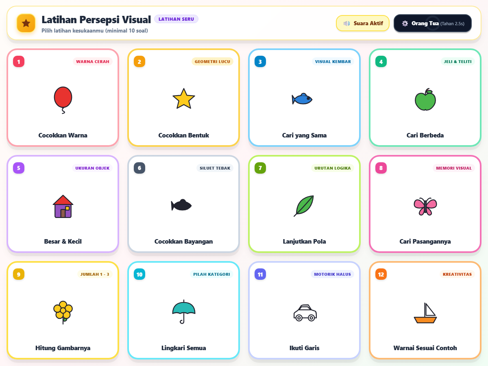
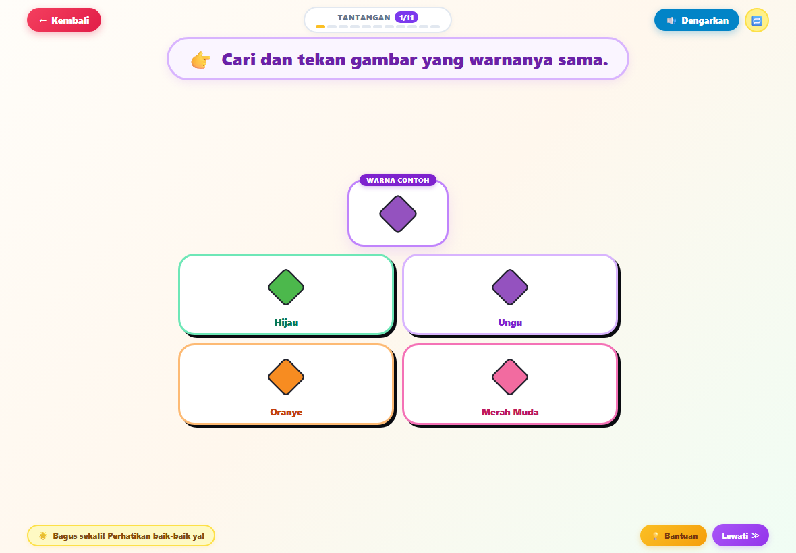
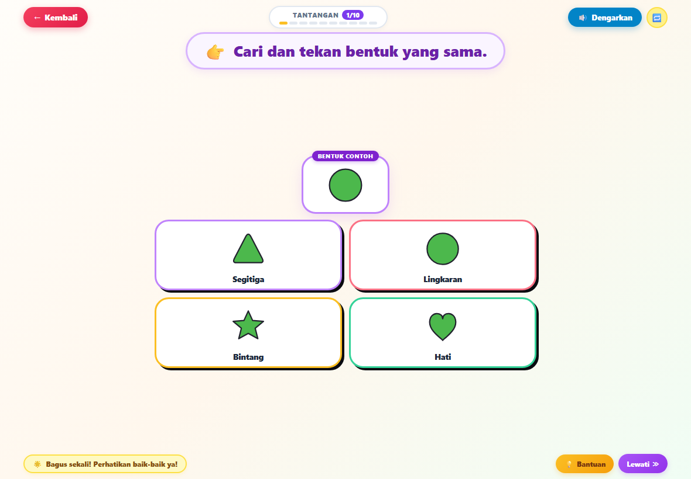
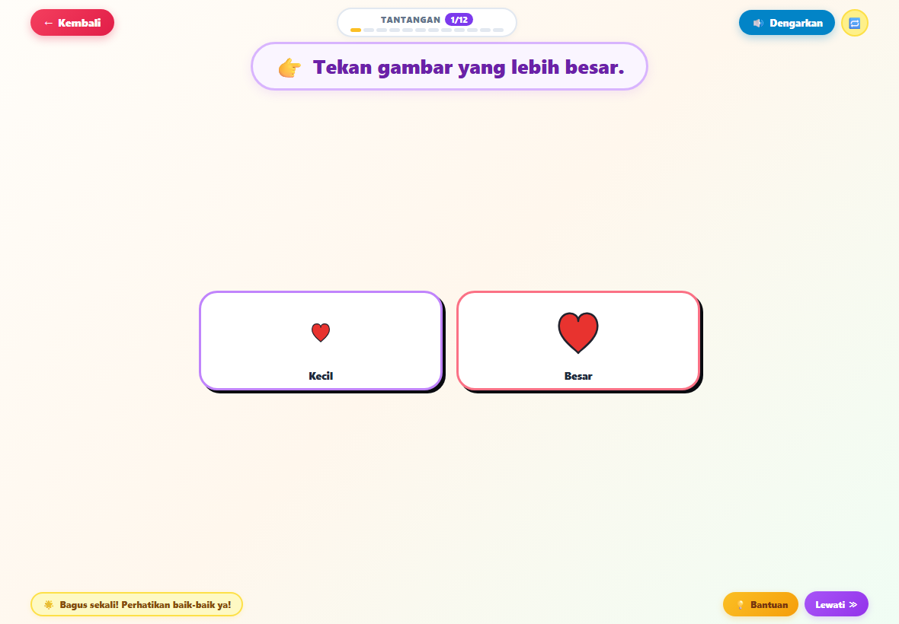
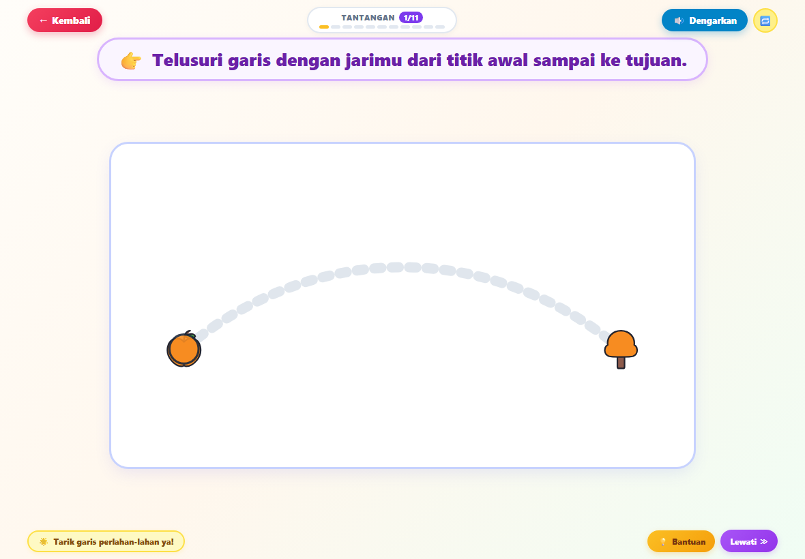
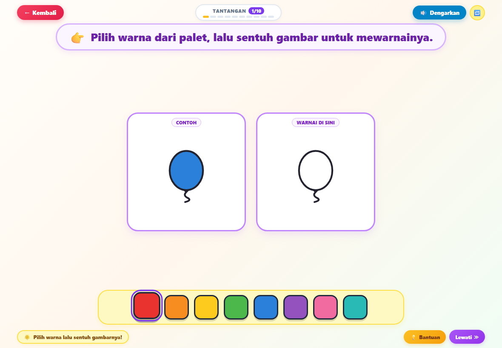

<div align="center">

# 🎨 Worksheet4Kids
### Aplikasi Webapp Latihan Persepsi Visual Anak Usia 3 Tahun
**100% Offline-First PWA • Sentuhan Ramah Balita • Tanpa Iklan • Nol Tekanan Skor**

[](https://www.typescriptlang.org/)
[](https://vitejs.dev/)
[](https://web.dev/progressive-web-apps/)
[-success.svg?style=flat-square&logo=vitest)](https://vitest.dev/)
[](LICENSE)

<br/>



</div>

---

## 🌟 Tentang Aplikasi

**Worksheet4Kids** adalah aplikasi latihan persepsi visual interaktif yang dirancang khusus untuk balita usia 3 tahun guna melengkapi lembar kerja cetak (*printable worksheets*). Mengadopsi estetika desain **Bubbly Neobrutalism** yang ceria, hangat, dan empuk, aplikasi ini memastikan pengalaman belajar yang menyenangkan, aman, dan tanpa rasa frustrasi bagi anak usia dini.

---

## ✨ Fitur Unggulan

- 🧸 **Desain Bubbly Neobrutalist (*Google Stitch Style*)**:
 - Warna-warni pastel yang nyaman untuk mata anak dan orang tua.
 - Kartu-kartu empuk (*chunky cards*) dengan lis tebal ceria dan animasi membal saat ditekan (*card bounce*).
 - Banner instruksi melayang berukuran besar dengan emoji penunjuk 👉 yang sangat mudah dibaca.
- 🖐️ **Ergonomi Sentuhan Khusus Balita**:
 - **Palm Rejection**: Menolak sentuhan telapak tangan tak sengaja saat anak menyandarkan tangan di layar tablet.
 - **Debounce**: Mencegah ketukan ganda atau pantulan cepat (*rapid double tap*).
- 🌈 **Eksplorasi Tanpa Tekanan (*Zero-Pressure Exploration*)**:
 - Tanpa skor, tanpa bintang ranking harian (★★★), dan tanpa pengukur waktu (*timer*).
 - Tidak ada suara salah atau nada negatif. Jawaban belum tepat hanya memicu goyangan halus (*gentle wobble*) tanpa menghakimi anak.
- 🔒 **Gerbang Area Orang Tua (*Parental Gate*)**:
 - Tombol pengaman *long-press* 2.5 detik dengan indikator cincin progres SVG untuk mencegah balita masuk ke pengaturan sistem.
 - Panduan lengkap penguncian tablet: **Guided Access** (Apple iPadOS) dan **App Pinning** (Android).
- ⚡ **100% Offline-First PWA (Nol CDN)**:
 - Seluruh kode, gambar vektor SVG, gaya CSS, dan audio disimpan secara lokal melalui Service Worker.
 - Bekerja seketika di *Airplane Mode* tanpa kuota internet dan bebas iklan/pelacak data.

---

## 📸 Galeri Tangkapan Layar

<div align="center">

| 1. Cocokkan Warna | 2. Cocokkan Bentuk |
| :---: | :---: |
|  |  |

| 5. Besar & Kecil | 11. Ikuti Garis (Tracing) |
| :---: | :---: |
|  |  |

| 12. Warnai Sesuai Contoh |
| :---: |
|  |

</div>

---

## 🎯 Daftar 12 Modul Latihan

| No | Modul Latihan | Tipe Interaksi | Keterangan Pedagogis |
| :-: | :--- | :---: | :--- |
| **01** | **Cocokkan Warna** | Tekan-Pilih (4 Kartu) | Mengidentifikasi warna yang sama dengan contoh dari 4 pilihan warna palet kontras. |
| **02** | **Cocokkan Bentuk** | Tekan-Pilih (4 Kartu) | Mengenal bentuk geometri dasar (lingkaran, persegi, segitiga, bintang, hati, bulan). |
| **03** | **Cari yang Sama** | Tekan-Pilih (4 Kartu) | Mencari objek kembar yang identik dengan objek contoh. |
| **04** | **Cari Berbeda** | Tekan-Pilih (4 Kartu) | Menemukan satu objek yang ganjil/berbeda dari 3 objek kembar lainnya. |
| **05** | **Besar & Kecil** | 2 Slot Penuh | Membedakan ukuran objek dengan perbandingan rasio skala visual 2.22×. |
| **06** | **Cocokkan Bayangan** | Tekan-Pilih (4 Kartu) | Mencocokkan siluet monolitik gelap dengan gambar aslinya. |
| **07** | **Lanjutkan Pola** | Deret Sekuensial (2 Pilihan) | Menemukan kelanjutan pola berulang [A - B - A - ?]. |
| **08** | **Cari Pasangannya** | Tekan-Pilih (4 Kartu) | Menemukan 2 kartu kembar di antara kartu pengecoh; memicu animasi pop serentak. |
| **09** | **Hitung Gambarnya** | Tombol Angka Chunky | Menghitung pameran 1–3 buah objek dengan tombol angka berukuran besar (1, 2, 3). |
| **10** | **Lingkari Semua Sama** | Multi-Target (8 Slot) | Mencari 3 target yang sama dengan contoh dari 8 slot menggunakan stempel lingkaran. |
| **11** | **Ikuti Garis** | *Finger Tracing* | Menelusuri jalur kurva halus dengan koridor toleransi 75px ramah motorik balita. |
| **12** | **Warnai Sesuai Contoh** | Kanvas Mewarnai | Meniru warna contoh dengan memilih warna palet lalu menyentuh kanvas outline. |

---

## 📖 Panduan Penggunaan

### 👶 Untuk Anak (Balita):
1. **Pilih Permainan**: Di layar utama, sentuh salah satu kartu warna-warni yang disukai.
2. **Dengarkan Petunjuk**: Sentuh tombol **🔊 Dengarkan** di kanan atas untuk mendengar suara instruksi narasi.
3. **Mulai Belajar**:
 - Sentuh kartu pilihan yang sesuai dengan petunjuk soal.
 - Pada latihan **Ikuti Garis**, usap jari mengikuti garis putus-putus dari awal ke tujuan.
 - Pada latihan **Warnai Contoh**, pilih warna di bilah bawah lalu sentuh gambar kanvas.
4. **Bantuan & Lewati**: Sentuh tombol **💡 Bantuan** jika butuh petunjuk, atau sentuh **Lewati ≫** untuk melanjutkan ke soal berikutnya.

### 👨‍👩‍👧 Untuk Orang Tua / Pendidik:
1. **Mengunci Layar Tablet**:
 - **Apple iPad (iOS)**: Aktifkan **Guided Access** (*Akses Terpandu*) di setelan aksesibilitas, lalu tekan tombol daya 3× saat membuka webapp.
 - **Android Tablet**: Aktifkan **App Pinning** (*Sematkan Aplikasi*) pada menu *Recent Apps* tablet Anda.
2. **Pengaturan Suara**:
 - Sakelar suara instan tersedia di header beranda (**🔊 Suara Aktif** / **🔇 Suara Senyap**).
3. **Membuka Area Orang Tua**:
 - Tekan dan tahan tombol **⚙️ Orang Tua (Tahan 2.5s)** selama 2.5 detik hingga cincin progres terisi penuh.

---

## 💻 Menjalankan Proyek Secara Lokal

### Prasyarat
- [Node.js](https://nodejs.org/) versi 18 ke atas.
- Peramban web modern (Google Chrome, Safari, atau Firefox).

### Langkah Instalasi
```bash
# 1. Clone repositori ini
git clone https://github.com/oktavianrizalm/Worksheet4Kids.git
cd Worksheet4Kids

# 2. Instal dependensi
npm install

# 3. Jalankan server lokal (mode dev)
npm run dev

# 4. Buka di peramban
# Kunjungi http://localhost:3000/ di browser Anda
```

### Skrip yang Tersedia
- `npm run dev` : Menjalankan server pengembangan Vite.
- `npm test` : Menjalankan pengujian otomatis unit test (Vitest).
- `npm run build` : Mengompilasi TypeScript dan membangun bundel produksi teroptimasi.
- `npm run preview` : Meninjau hasil build produksi secara lokal.

---

## 🛡️ Arsitektur & Prinsip Teknis

- **Nol Dependensi UI Framework**: Murni TypeScript dan Vanilla DOM Engine dengan ukuran sangat ramping (<20 kB gzipped).
- **Vektor Murni (*Zero Raster Overhead*)**: Seluruh 28 objek ilustrasi dibuat dengan kode SVG aman tanpa berkas bitmap JPEG/PNG eksternal.
- **Single Source of Truth**: Seluruh token desain (warna, tipografi, radius, bayangan) terpusat pada [src/tokens.ts](src/tokens.ts).
- **Toleransi Anti-Frustrasi**: Progres usapan garis jari tidak akan direset jika jari anak terangkat tanpa sengaja di tengah perjalanan.

---

## 📄 Lisensi

Proyek ini dirilis di bawah lisensi [MIT](LICENSE). Bebas digunakan, dipelajari, dan dikembangkan untuk kepentingan pendidikan anak usia dini.
